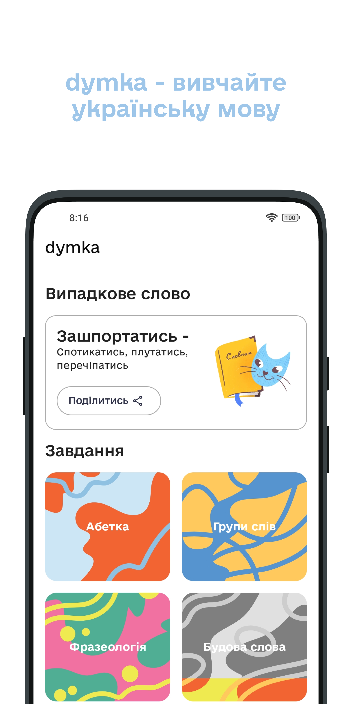
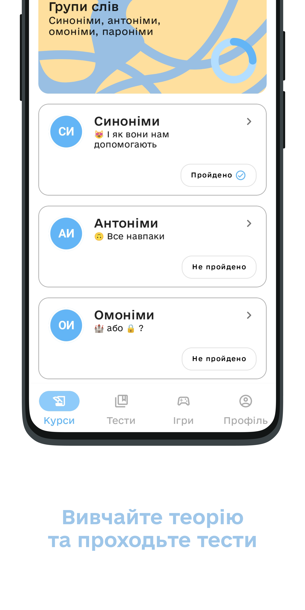
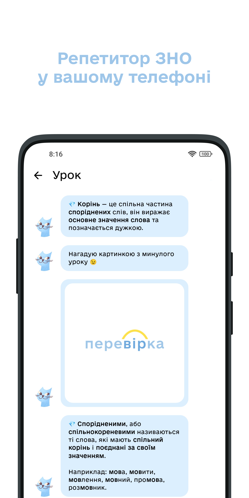
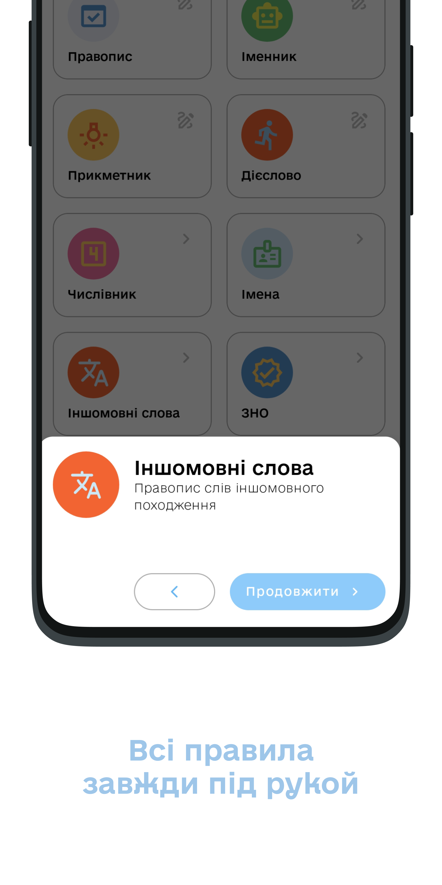
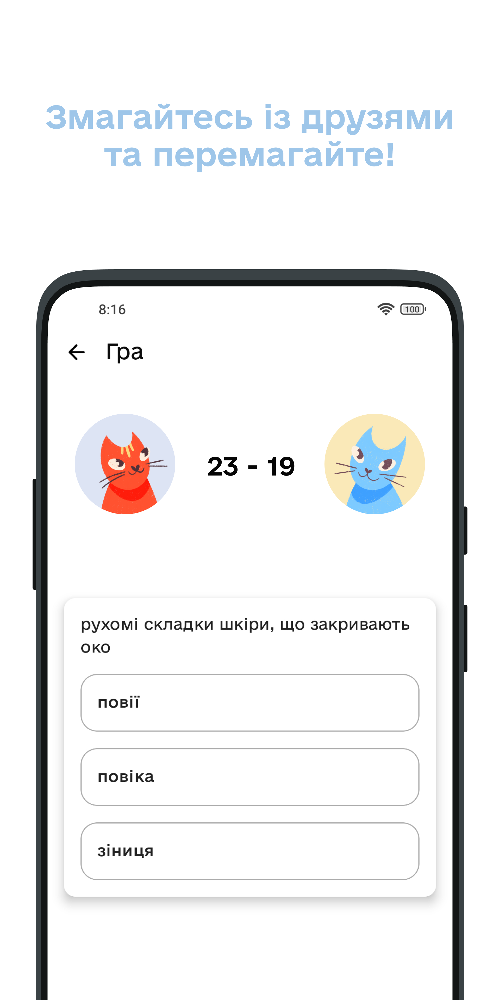
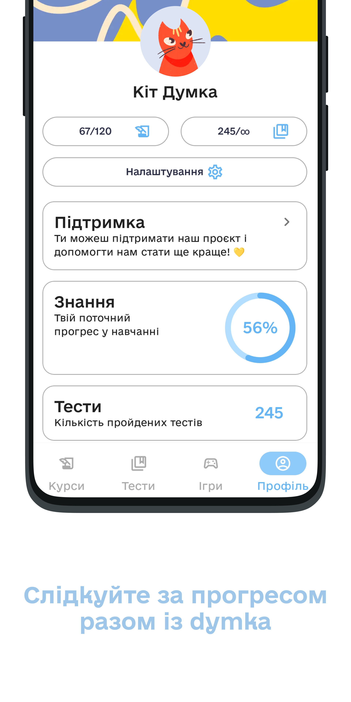

# [dymka](https://play.google.com/store/apps/details?id=com.ribsky.dymka)

[](#) [](#)

|          |             |                |
| :---:    |    :----:   |          :---: |
|  |  |  |
|  |  |  |

> 😖 Проєкт був створений для навчальних цілей і може містити помилки


dymka – новий застосунок, за допомогою якого ви можете вивчати українську мову, займатися підготовкою до контрольних та самостійних робіт, ЗНО та ДПА. dymka допоможе вам вивчати українську мову за темами, проходити тести, вивчати нові слова, щоб покращити свої знання! Наш застосунок – кишеньковий репетитор української мови, який дозволить вам навчатися з нуля як онлайн, так і без інтернету.


<a href='https://play.google.com/store/apps/details?id=com.ribsky.dymka&pcampaignid=pcampaignidMKT-Other-global-all-co-prtnr-py-PartBadge-Mar2515-1'></a>


### Основний стек:

- Kotlin
- XML Views
- Material Design You and Material Design 2
- Firebase Services
- ViewBinding
- [Koin](https://github.com/InsertKoinIO/koin)
- Coroutines

### Інші бібліотеки:

#### UI:
- [State Delegator](https://github.com/RedMadRobot/state-delegator)
- [Coil](https://github.com/coil-kt/coil)
- [CircularProgressBar](https://github.com/lopspower/CircularProgressBar)
- [Konfetti](https://github.com/DanielMartinus/Konfetti)
- [Shimmer](https://github.com/facebook/shimmer-android)
- [Avatarview](https://github.com/GetStream/avatarview-android)

#### Інше:
- [Easy-checkout](https://github.com/alessandrojp/android-easy-checkout)
- [Kpermissions](https://github.com/fondesa/kpermissions)
- [Moshi](https://github.com/square/moshi)
- Room
- Lifecycle
- LiveData
- Navigation component
- AppUpdate
- Nearby
- Android Jetpack

#### Архітектура:

- MVVM
- Clean Architecture
- MultiModule

##### Модулі:

###### Основне:

+ core
    + Основний модуль додатка, що DI
+ common
    + Основний модуль додатка, що містить загальні компоненти та функції
+ domain
	+ Модуль, що містить бізнес-логіку та базові класи даних
+ data
	+ Модуль для доступу до даних (бази даних та API)
+ navigation
	+ Модуль для керування навігацією в додатку
+ features
	+ UI частина

###### Допоміжні:
+ permission
    + Модуль для керування дозволами на пристрої користувача
+ analytics
    + Модуль для збору та аналізу даних про використання додатка
+ billing
    + Модуль для інтеграції платіжної системи


### Back-end:

Для Back-end  використовується Firebase, а саме:

##### 1. AppCheck
Для перевірки цілосності застосунку

##### 2. Firebase Auth
Для авторизації за допомогою Google

##### 2. Firestore Database
Для зберігання уроків, тестів та слів

###### Уроки
> lessons -> uId ->

```json
{
  "id": "string",
  "paragraphId": "string",
  "content": "string.json",
  "name": "string",
  "description": "",
  "hasPrem": false,
  "sort": 1
}
```

###### Теми
> paragraph -> uId ->

```json
{
  "id": "string",
  "name": "string",
  "sort": 1
}
```

###### Тести
> books -> uId ->

```json
{
  "id": "string",
  "content": "string.json",
  "title": "string",
  "description": "string",
  "image": "string",
  "colors": {
  "background": "string",
  "primary": "string"
  },
  "hasPrem": false,
  "sort": 1
}
```

###### Слова
> words -> words ->

```json
{
      "link": "string"
  }
```


##### 3. Storage
Для зберігання медіа-контенту з тестів або уроків

##### 4. Realtime Database
Для зберігання даних користувачів
```json
{
  "users": {
    "id": {
      "email": "example@example.com",
      "hasPrem": false,
      "image": "string",
      "lessonsCount": 0,
      "lessons": {
        "uid0": "lessonId",
        "uid1": "lessonId"
      },
      "name": "кіт Думка",
      "score": 0,
      "version": 0
    }
}
```

##### 5. Messanging
Для надсилання сповіщень

#### Формат контенту:
Весь контент зберігається у форматі ```json ``` та має різну структуру.

##### 1. Уроки:

+ Загальна структура
```json
{
  "content": [
    {},
    {}
  ]
}
```

+ Текстове повідомлення
```json
    {
      "type": "text",
      "text": "Вітаю! Мене звуть кіт Думка 🐈",
      "action": ""
    },
```

+  Картинка
```json
    {
      "type": "image",
      "url": "gs://dymka-ua.appspot.com/images/content/root.png"
    }
```
+ Відкрите питання
```json
    {
      "type": "translate_text",
      "text": [
        {
          "original_text": "Нагадай, як мене звати?",
          "translated_text": [
            "dymka",
            "думка",
            "кіт думка",
            "кіт dymka"
          ]
        }
      ]
    }
```
+ Тест
```json
    {
      "type": "test_pick",
      "text": [
        {
          "original_text": "Хто я?",
          "translated_text": [
            {
              "text": "Кіт",
              "value": true
            },
            {
              "text": "Собака",
              "value": false
            },
            {
              "text": "Птах",
              "value": false
            }
          ]
        }
      ]
    }
```
+ Декілька відповідей
```json
    {
      "type": "translate_chips",
      "text": [
        {
          "original_text": "Обери всі слова, які описують мене",
          "translated_text": [
            "гарний",
            "розумний",
            "блакитний",
            "кумедний"
          ],
          "chips": [
            "гарний",
            "розумний",
            "блакитний",
            "кумедний",
            "червоний"
          ]
        }
      ]
    },
```

+ Знайти помилку

```json
    {
      "type": "find_mistake",
      "text": [
        {
          "original_text": "Вітання! Моє ім'я Димка. Я сподіваюсь, що моя допомога стане тобі у пригоді!",
          "translated_text": "Вітання! Моє ім'я Думка. Я сподіваюсь, що моя допомога стане тобі у пригоді!"
        }
      ]
    }
```


##### 1. Тести:

Загальна структура
```json
[
    {},
    {}
]
```

```json
  {
    "id": "LVcwjx33YClqanj6BCJ7Xow1peuDPsJILbqG49m27nDfCHKNspfqjKfeGLhMVHH6",
    "original_word": "абсолютний",
    "question": "Обери відповідник",
    "translated_word": [
      {
        "name": "цілковитий",
        "correct": true
      },
      {
        "name": "конкретний",
        "correct": false
      },
      {
        "name": "точний",
        "correct": false
      }
    ]
  }
```

##### 2. Слова:

Загальна структура
```json
[
    {},
    {}
]
```

```json
 {
    "title": "Базі́кати -",
    "description": "Говорити багато та беззмістовно"
  }
```

### Автор:

- GitHub: [@nexy791](https://github.com/nexy791)
- License: Apache-2.0 License

```

Copyright 2022 Olexandr Yasinskyi

Licensed under the Apache License, Version 2.0 (the "License");
you may not use this file except in compliance with the License.
You may obtain a copy of the License at

<http://www.apache.org/licenses/LICENSE-2.0>

Unless required by applicable law or agreed to in writing, software
distributed under the License is distributed on an "AS IS" BASIS,
WITHOUT WARRANTIES OR CONDITIONS OF ANY KIND, either express or implied.
See the License for the specific language governing permissions and
limitations under the License.

```


